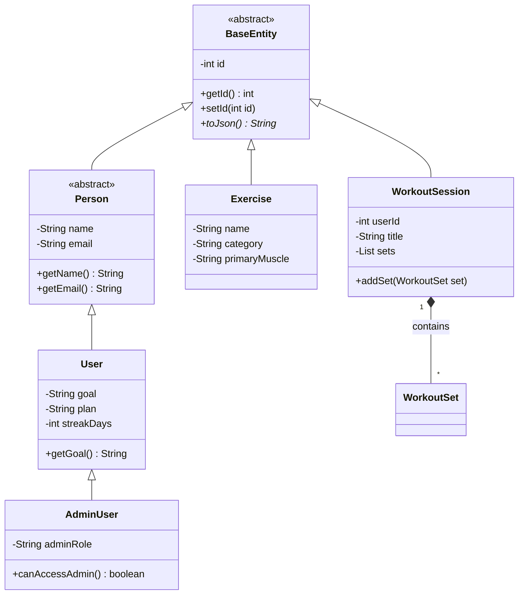

# FitRank: Premium Fitness Management System
**Software Engineering Project Report**

## 1. Problem Statement
Fitness enthusiasts often struggle to track their progress, recovery, and nutrition across multiple isolated platforms. Existing solutions are either too complex for quick logging or lack the analytical depth required for serious strength athletes. 

**FitRank** is a centralized fitness management system designed to apply rigorous software engineering practices to the domain of athletic performance. It provides a modular, maintainable, and persistent application for logging workouts, analyzing progress through data-driven charts, and managing exercise libraries using a relational database.

## 2. Functional Requirements

### 1. User Management
- **User Authentication**: Secure login and signup system for athletes and administrators.
- **Profile Management**: Users can update their fitness goals (Strength, Muscle Gain, etc.) and personal details.
- **Role-Based Access**: Administrators have higher-level access to system-wide analytics and user management.

### 2. Database Operations (CRUD)
- **Workout Sessions**: Create, read, update, and delete workout logs.
- **Exercise Library**: Manage a catalog of exercises with categories, equipment, and instructions.
- **Nutrition & Weight**: Persistent storage for daily calorie intake and body weight measurements.
- **Data Persistence**: All records are stored in a relational PostgreSQL database using JDBC.

### 3. Additional Features (Bonus Credit)
- **Login Authentication System**: Secure session-based access.
- **Role-Based Access Control (RBAC)**: Distinct permissions for `AdminUser` and standard `User`.
- **Search & Filter**: Searchable exercise library and dynamic date-range filters for analytics.
- **Report Generation**: Real-time chart rendering for Volume, Calories, and PRs.

---

## 3. Object-Oriented Design (OOP)
FitRank demonstrates advanced OOP principles through a modular Java architecture.

### OOP Implementation Checklist
- [x] **Classes and Objects**: Entities like `WorkoutSession`, `Exercise`, and `User` encapsulate real-world concepts.
- [x] **Encapsulation**: Used in all entity classes with `private` fields and `public` getters/setters.
- [x] **Inheritance**: 
    - `BaseEntity` (root) &rarr; `Person` &rarr; `User` &rarr; `AdminUser`.
- [x] **Polymorphism**: 
    - **Overriding**: `toJson()` is overridden in all entity classes to provide specific JSON serialization.
    - **Overloading**: `WorkoutSession` handles `addSet()` with different parameter signatures.
- [x] **Abstraction**: 
    - `BaseEntity` and `Person` are `abstract` classes.
    - `CrudRepository<T>` is a generic `interface` defining standard data operations.
- [x] **Collections**: Use of `ArrayList` in `WorkoutSession` (for sets) and `MemoryRepository` (for record tracking).

### Class Diagram


---

## 4. System Architecture
FitRank follows a **Layered Architecture** to ensure separation of concerns and maintainability.

1. **Presentation Layer**: 
    - Interactive SPA (Single Page Application) built with Vanilla JavaScript, HTML5, and CSS3.
    - Features Glassmorphism design and responsive charts.
2. **Business Logic Layer**: 
    - Java logic implemented in the `backend` package. Handles workout calculations (volume, 1RM) and user authentication.
3. **Data Access Layer (DAO)**: 
    - `JdbcFitRankRepository` implements the `CrudRepository` interface to interact with the database via JDBC.
4. **Database Layer**: 
    - PostgreSQL Relational Database storing users, workouts, exercises, and sets.

---

## 5. Database Requirements

### Database Schema (SQL)
```sql
CREATE TABLE users (
  id SERIAL PRIMARY KEY,
  name VARCHAR(120) NOT NULL,
  email VARCHAR(180) UNIQUE NOT NULL,
  password_hash VARCHAR(255) NOT NULL,
  goal VARCHAR(80) DEFAULT 'Strength',
  role VARCHAR(40) DEFAULT 'USER'
);

CREATE TABLE exercises (
  id SERIAL PRIMARY KEY,
  name VARCHAR(160) NOT NULL,
  category VARCHAR(80) NOT NULL,
  primary_muscle VARCHAR(80) NOT NULL
);

CREATE TABLE workout_sessions (
  id SERIAL PRIMARY KEY,
  user_id INTEGER REFERENCES users(id),
  title VARCHAR(160) NOT NULL,
  volume NUMERIC(8,2) DEFAULT 0
);
```

### Sample Data
- **User**: `Arjun Nair (arjun@example.com)`
- **Exercises**: `Barbell Bench Press`, `Back Squat`, `Pull Up`.
- **History**: Imported dataset contains 67 workouts and 4.9M total steps from Apple Health.

---

## 6. Application Output (Screenshots)

````carousel

<!-- slide -->

<!-- slide -->

<!-- slide -->

````

---

## 7. How to Run

### 1. Database Setup
1. Run `database/schema.sql` in your PostgreSQL instance.
2. Ensure the JDBC driver is available.

### 2. Start API (Backend)
```powershell
cd fitrank-pro/backend
javac -d out src/com/fitrank/app/*.java
java -cp out com.fitrank.app.FitRankServer
```

### 3. Start PWA (Frontend)
```powershell
cd fitrank-pro
python serve.py 5173
```
Open `http://localhost:5173` in your browser.
